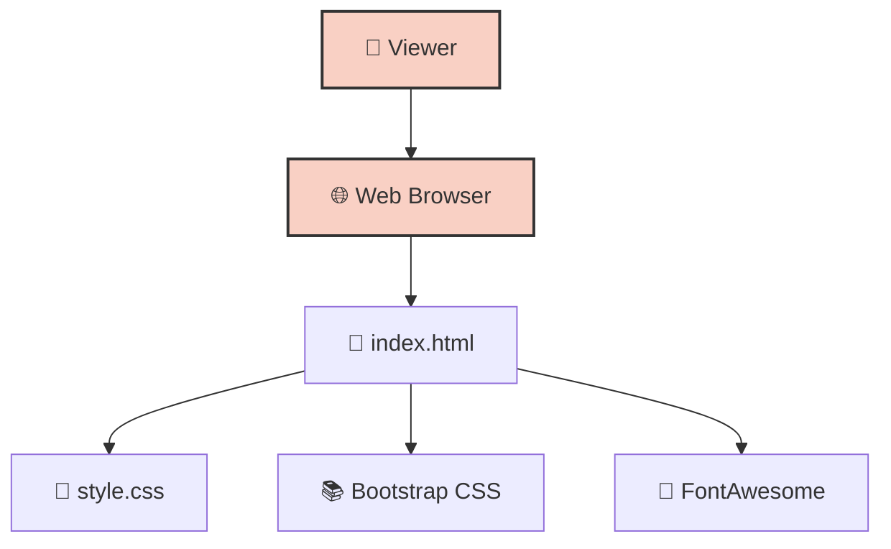

# 🏆 Commercial Proposal for Decathlon

An interactive, web-based commercial proposal and presentation designed specifically for Decathlon.

## 🚀 Overview

This repository contains the static files for an HTML/CSS presentation built using Bootstrap. It is structured as an interactive web page to outline an approach scheme, commercial offer, or presentation for the brand Decathlon.

## 🛠 Technology Stack

- **Core**: HTML5, CSS3
- **Framework**: Bootstrap 3.3.7
- **Icons**: FontAwesome
- **Layout**: Responsive grid system, Accordions/Panels

## 🏗 Architecture / Workflow

## ⚙️ Quick Start

This is a static web page and does not require any build tools or package managers.

1. Clone the repository: `git clone https://github.com/iv150320/777.git`
2. Navigate into the directory: `cd 777`
3. Simply open the `index.html` file in any modern web browser.
   - Alternatively, serve it locally using Python: `python3 -m http.server 8000` and visit `http://localhost:8000`.

---
**Author**: @iv150320
